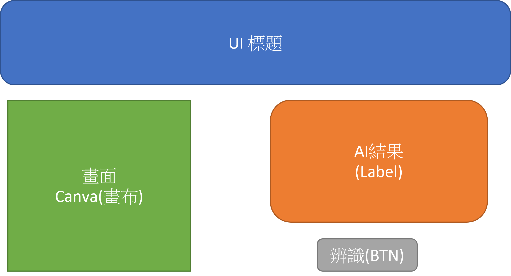
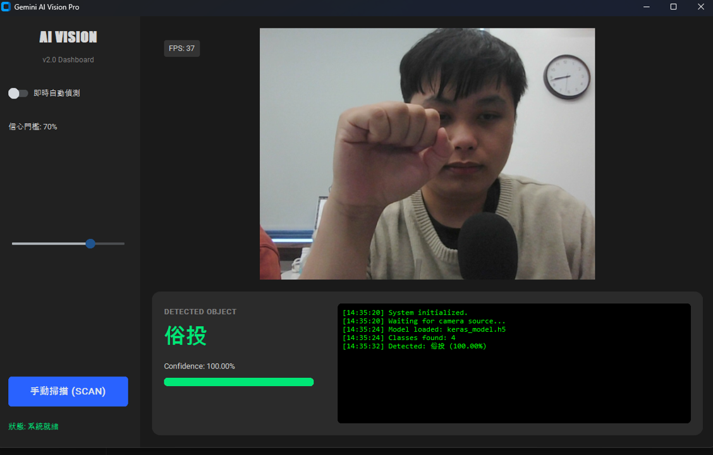
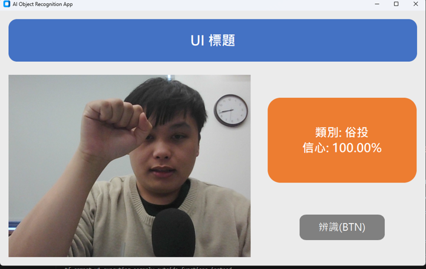

# HarryAI - 智能視覺辨識系統 (Intelligent Vision System)

歡迎使用 **HarryAI**！這是一個整合了 Google Teachable Machine 模型、OpenCV 即時影像處理，以及 Modern GUI (CustomTkinter) 的全方位 AI 視覺辨識專案。從基礎的攝影機串流到駭客風格的監控儀表板，本專案提供了完整的 Python 實作範例。

---

## 📂 專案結構 (Project Structure)

本專案採用模組化設計，包含後端邏輯、前端介面以及豐富的 Python 範例程式。

```text
HarryAIProject/
├── backend/                # Python 後端服務 (Flask/FastAPI)
├── frontend/               # Vue.js 前端應用程式
├── Example/                # 🔥 核心範例程式與截圖
│   ├── camera_stream.py    # 基礎：OpenCV 攝影機測試
│   ├── tm.py               # 核心：Teachable Machine 模型推論 (CLI版)
│   ├── app_ui.py           # 進階：GUI 視窗應用程式 (還原設計稿)
│   ├── app_ui_modern.py    # 旗艦：現代化 AI 儀表板 (Dashboard)
│   └── 圖片1~3.png         # 範例截圖
├── keras_model.h5          # 訓練好的 AI 模型 (Teachable Machine)
└── labels.txt              # 模型類別標籤
```

---

## 🚀 快速開始 (Getting Started)

### 1. 環境設定
建議使用 Anaconda 或 Python 虛擬環境 (Python 3.9+)。

```bash
# 安裝必要套件
pip install opencv-python pillow numpy customtkinter tf-keras tensorflow
```

### 2. 模型準備
請確保您的 `keras_model.h5` 與 `labels.txt` 位於 `HarryAIProject/` 根目錄下。
> 本專案預設支援 Teachable Machine 匯出的 Keras 模型。

---

## 📖 使用手冊 (User Manual)

本專案提供三種不同層次的應用程式，滿足從測試到展示的各種需求。

### 🎨 階段一：概念設計與基礎還原 (`app_ui.py`)

我們首先根據 UI 設計概念圖，使用 `customtkinter` 100% 還原了介面佈局。此程式適合用於驗證介面設計與基礎功能的整合。

- **功能**：
    - 左側顯示即時攝影機畫面 (Green Canvas)。
    - 右側顯示 AI 辨識結果與信心分數 (Orange Panel)。
    - 底部操作按鈕 (Grey Button)。

**設計概念圖 vs 實作畫面：**

| 原始設計概念 (Design) | 基礎功能實作 (Implementation) |
| :---: | :---: |
|  | *(請參考執行畫面)* |

*執行指令：*
```bash
python HarryAIProject/Example/app_ui.py
```

---

### 💻 階段二：現代化 AI 儀表板 (`app_ui_modern.py`)

展現 AI 強大能力的旗艦級應用。採用深色主題 (Dark Mode)，整合即時數據監控與自動化功能。

- **🌟 核心特色**：
    - **Cyberpunk 風格介面**：專業、高科技感的視覺體驗。
    - **即時數據監控**：動態信心分數進度條 (Confidence Bar) 與 FPS 顯示。
    - **自動/手動模式切換**：支援開關自動偵測，釋放雙手。
    - **智慧門檻過濾**：可透過滑桿調整信心門檻，過濾低可信度的雜訊。
    - **系統日誌 (System Log)**：駭客終端機風格的即時狀態紀錄。

**儀表板介面展示：**



*執行指令：*
```bash
python HarryAIProject/Example/app_ui_modern.py
```

---

### 🔧 階段三：核心推論測試 (`tm.py`)

如果您不需要圖形介面，只想測試模型載入與推論效能，可以使用此 CLI 工具。它會開啟一個簡單的 OpenCV 視窗並在終端機輸出結果。

**執行畫面範例：**



*執行指令：*
```bash
python HarryAIProject/Example/tm.py
```

---

## 🛠️ 常見問題 (FAQ)

**Q: 執行時出現 `ValueError: Unrecognized keyword arguments passed to DepthwiseConv2D: {'groups': 1}`？**
A: 這是 Keras 版本相容性問題。請確保您安裝了 `tf-keras` 並在程式碼中使用 `from tf_keras.models import load_model` (本專案範例程式已包含此修正)。

**Q: 攝影機無法開啟？**
A: 請檢查是否有其他程式佔用了攝影機，或嘗試修改程式碼中的 `cv2.VideoCapture(0)` 索引值為 `1` 或 `2`。

---

_Project maintained by HarryAI Team. 2026._
